# 🏗️ Authentication Microservice - Architecture Documentation

This document provides comprehensive architectural diagrams and explanations for the Go Authentication Microservice, following Clean Architecture principles and industry best practices.

## 📋 Table of Contents

1. [System Overview](#system-overview)
2. [Clean Architecture Layers](#clean-architecture-layers)
3. [Component Architecture](#component-architecture)
4. [Database Schema](#database-schema)
5. [API Flow Diagrams](#api-flow-diagrams)
6. [Security Architecture](#security-architecture)
7. [Deployment Architecture](#deployment-architecture)
8. [Data Flow Patterns](#data-flow-patterns)

---

## 🎯 System Overview

### High-Level System Architecture

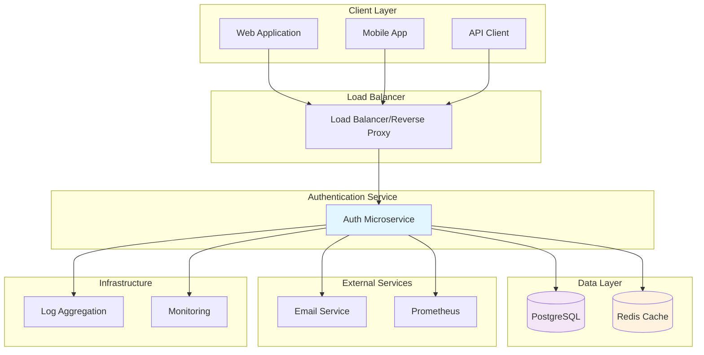
```mermaid
graph TB
    subgraph "Client Layer"
        WEB[Web Application]
        MOBILE[Mobile App]
        API_CLIENT[API Client]
    end
    
    subgraph "Load Balancer"
        LB[Load Balancer/Reverse Proxy]
    end
    
    subgraph "Authentication Service"
        AUTH[Auth Microservice]
    end
    
    subgraph "Data Layer"
        DB[(PostgreSQL)]
        REDIS[(Redis Cache)]
    end
    
    subgraph "External Services"
        EMAIL[Email Service]
        METRICS[Prometheus]
    end
    
    subgraph "Infrastructure"
        LOGS[Log Aggregation]
        MONITOR[Monitoring]
    end
    
    WEB --> LB
    MOBILE --> LB
    API_CLIENT --> LB
    
    LB --> AUTH
    
    AUTH --> DB
    AUTH --> REDIS
    AUTH --> EMAIL
    AUTH --> METRICS
    
    AUTH --> LOGS
    AUTH --> MONITOR
    
    style AUTH fill:#e1f5fe
    style DB fill:#f3e5f5
    style REDIS fill:#fff3e0
```

### Technology Stack Overview

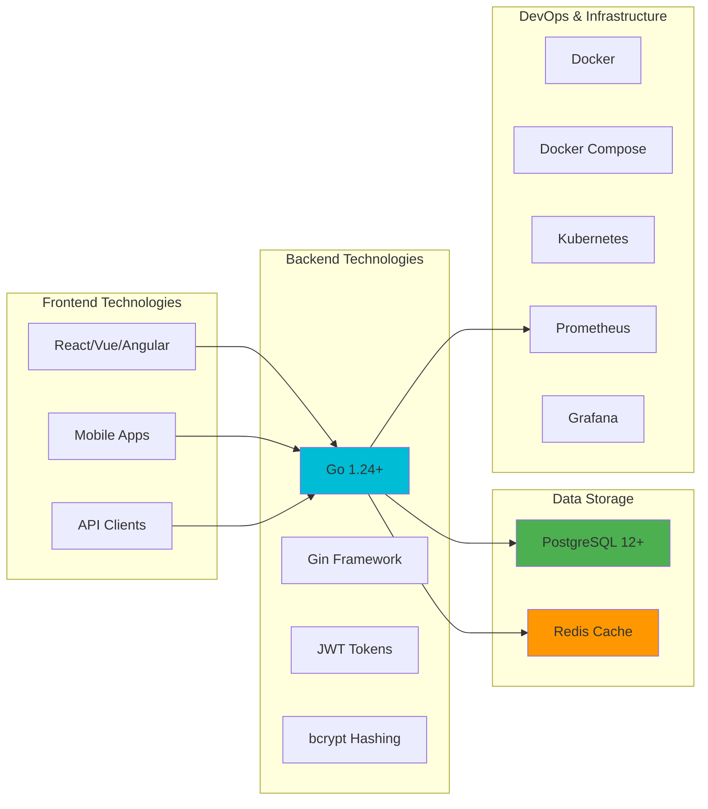
```mermaid
graph LR
    subgraph "Frontend Technologies"
        A[React/Vue/Angular]
        B[Mobile Apps]
        C[API Clients]
    end
    
    subgraph "Backend Technologies"
        D[Go 1.24+]
        E[Gin Framework]
        F[JWT Tokens]
        G[bcrypt Hashing]
    end
    
    subgraph "Data Storage"
        H[PostgreSQL 12+]
        I[Redis Cache]
    end
    
    subgraph "DevOps & Infrastructure"
        J[Docker]
        K[Docker Compose]
        L[Kubernetes]
        M[Prometheus]
        N[Grafana]
    end
    
    A --> D
    B --> D
    C --> D
    D --> H
    D --> I
    D --> M
    
    style D fill:#00BCD4
    style H fill:#4CAF50
    style I fill:#FF9800
```

---

## 🏛️ Clean Architecture Layers

### Layer Dependency Flow

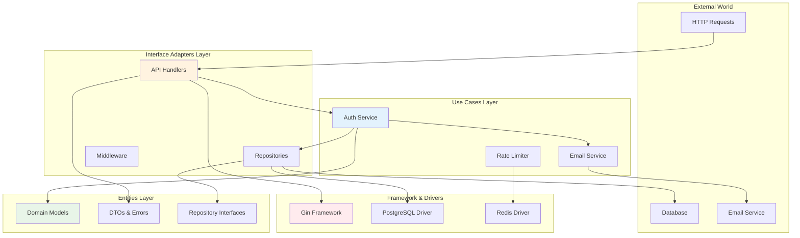
```mermaid
graph TD
    subgraph "External World"
        HTTP[HTTP Requests]
        DB_EXT[Database]
        EMAIL_EXT[Email Service]
    end
    
    subgraph "Interface Adapters Layer"
        API[API Handlers]
        REPO[Repositories]
        MIDDLEWARE[Middleware]
    end
    
    subgraph "Use Cases Layer"
        AUTH_SERVICE[Auth Service]
        EMAIL_SERVICE[Email Service]
        RATE_LIMIT[Rate Limiter]
    end
    
    subgraph "Entities Layer"
        DOMAIN[Domain Models]
        DTOS[DTOs & Errors]
        INTERFACES[Repository Interfaces]
    end
    
    subgraph "Framework & Drivers"
        GIN[Gin Framework]
        PGSQL[PostgreSQL Driver]
        REDIS_DRIVER[Redis Driver]
    end
    
    HTTP --> API
    API --> AUTH_SERVICE
    AUTH_SERVICE --> REPO
    REPO --> DB_EXT
    
    AUTH_SERVICE --> DOMAIN
    API --> DTOS
    REPO --> INTERFACES
    
    API --> GIN
    REPO --> PGSQL
    RATE_LIMIT --> REDIS_DRIVER
    
    EMAIL_SERVICE --> EMAIL_EXT
    AUTH_SERVICE --> EMAIL_SERVICE
    
    style DOMAIN fill:#E8F5E8
    style AUTH_SERVICE fill:#E3F2FD
    style API fill:#FFF3E0
    style GIN fill:#FFEBEE
```

### Directory Structure Mapping

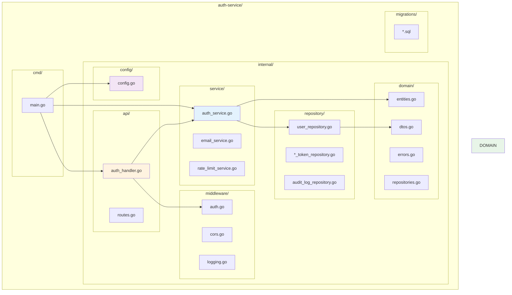
```mermaid
graph TD
    subgraph "auth-service/"
        subgraph "cmd/"
            MAIN[main.go]
        end
        
        subgraph "internal/"
            subgraph "domain/"
                ENTITIES[entities.go]
                DTOS[dtos.go]
                ERRORS[errors.go]
                REPOS[repositories.go]
            end
            
            subgraph "service/"
                AUTH_SVC[auth_service.go]
                EMAIL_SVC[email_service.go]
                RATE_SVC[rate_limit_service.go]
            end
            
            subgraph "repository/"
                USER_REPO[user_repository.go]
                TOKEN_REPO[*_token_repository.go]
                AUDIT_REPO[audit_log_repository.go]
            end
            
            subgraph "api/"
                HANDLERS[auth_handler.go]
                ROUTES[routes.go]
            end
            
            subgraph "middleware/"
                AUTH_MW[auth.go]
                CORS_MW[cors.go]
                LOGGING_MW[logging.go]
            end
            
            subgraph "config/"
                CONFIG[config.go]
            end
        end
        
        subgraph "migrations/"
            MIGRATIONS[*.sql]
        end
    end
    
    MAIN --> CONFIG
    MAIN --> AUTH_SVC
    MAIN --> HANDLERS
    
    HANDLERS --> AUTH_SVC
    AUTH_SVC --> USER_REPO
    AUTH_SVC --> ENTITIES
    
    USER_REPO --> DTOS
    HANDLERS --> AUTH_MW
    
    style DOMAIN fill:#E8F5E8
    style AUTH_SVC fill:#E3F2FD
    style HANDLERS fill:#FFF3E0
    style CONFIG fill:#F3E5F5
```

---

## 🔧 Component Architecture

### Service Layer Components

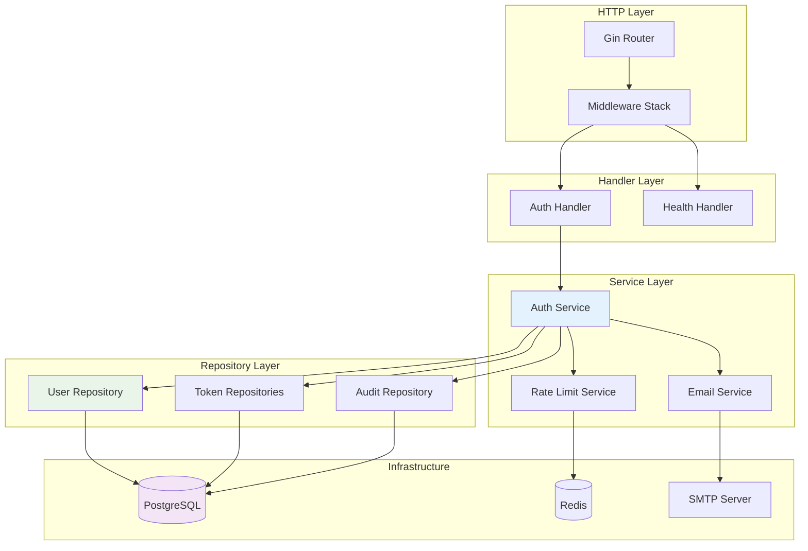
```mermaid
graph TB
    subgraph "HTTP Layer"
        ROUTER[Gin Router]
        MW[Middleware Stack]
    end
    
    subgraph "Handler Layer"
        AUTH_H[Auth Handler]
        HEALTH_H[Health Handler]
    end
    
    subgraph "Service Layer"
        AUTH_S[Auth Service]
        EMAIL_S[Email Service] 
        RATE_S[Rate Limit Service]
    end
    
    subgraph "Repository Layer"
        USER_R[User Repository]
        TOKEN_R[Token Repositories]
        AUDIT_R[Audit Repository]
    end
    
    subgraph "Infrastructure"
        DB[(PostgreSQL)]
        CACHE[(Redis)]
        SMTP[SMTP Server]
    end
    
    ROUTER --> MW
    MW --> AUTH_H
    MW --> HEALTH_H
    
    AUTH_H --> AUTH_S
    AUTH_S --> EMAIL_S
    AUTH_S --> RATE_S
    
    AUTH_S --> USER_R
    AUTH_S --> TOKEN_R
    AUTH_S --> AUDIT_R
    
    USER_R --> DB
    TOKEN_R --> DB
    AUDIT_R --> DB
    RATE_S --> CACHE
    EMAIL_S --> SMTP
    
    style AUTH_S fill:#E3F2FD
    style USER_R fill:#E8F5E8
    style DB fill:#F3E5F5
```

### Middleware Pipeline

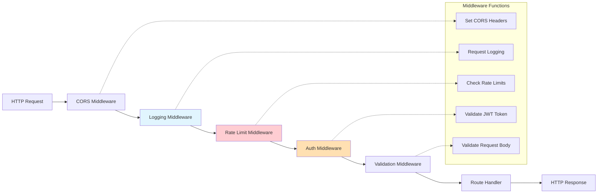
```mermaid
graph LR
    REQ[HTTP Request] --> CORS[CORS Middleware]
    CORS --> LOG[Logging Middleware]
    LOG --> RATE[Rate Limit Middleware]
    RATE --> AUTH[Auth Middleware]
    AUTH --> VALID[Validation Middleware]
    VALID --> HANDLER[Route Handler]
    HANDLER --> RESP[HTTP Response]
    
    subgraph "Middleware Functions"
        CORS_FUNC[Set CORS Headers]
        LOG_FUNC[Request Logging]
        RATE_FUNC[Check Rate Limits]
        AUTH_FUNC[Validate JWT Token]
        VALID_FUNC[Validate Request Body]
    end
    
    CORS -.-> CORS_FUNC
    LOG -.-> LOG_FUNC
    RATE -.-> RATE_FUNC
    AUTH -.-> AUTH_FUNC
    VALID -.-> VALID_FUNC
    
    style AUTH fill:#FFE0B2
    style RATE fill:#FFCDD2
    style LOG fill:#E1F5FE
```

---

## 🗄️ Database Schema

### Entity Relationship Diagram

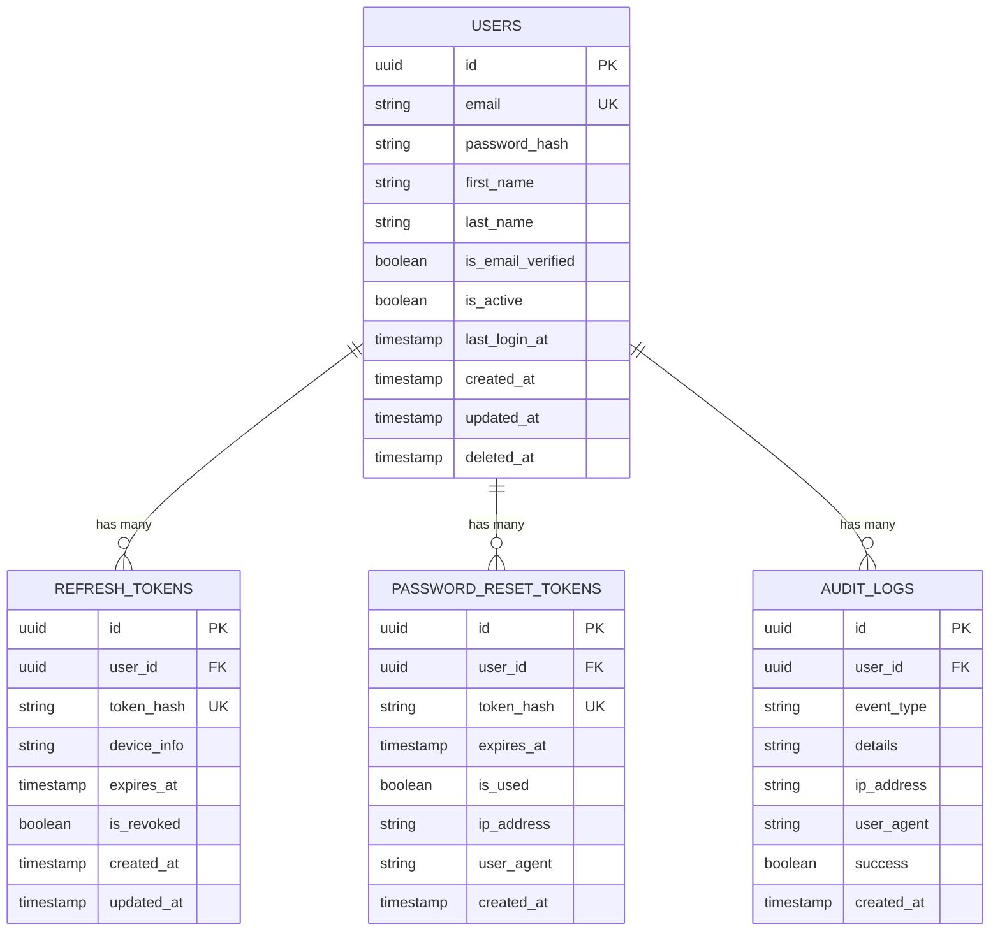
```mermaid
erDiagram
    USERS {
        uuid id PK
        string email UK
        string password_hash
        string first_name
        string last_name
        boolean is_email_verified
        boolean is_active
        timestamp last_login_at
        timestamp created_at
        timestamp updated_at
        timestamp deleted_at
    }
    
    REFRESH_TOKENS {
        uuid id PK
        uuid user_id FK
        string token_hash UK
        string device_info
        timestamp expires_at
        boolean is_revoked
        timestamp created_at
        timestamp updated_at
    }
    
    PASSWORD_RESET_TOKENS {
        uuid id PK
        uuid user_id FK
        string token_hash UK
        timestamp expires_at
        boolean is_used
        string ip_address
        string user_agent
        timestamp created_at
    }
    
    AUDIT_LOGS {
        uuid id PK
        uuid user_id FK
        string event_type
        string details
        string ip_address
        string user_agent
        boolean success
        timestamp created_at
    }
    
    USERS ||--o{ REFRESH_TOKENS : "has many"
    USERS ||--o{ PASSWORD_RESET_TOKENS : "has many"
    USERS ||--o{ AUDIT_LOGS : "has many"
```

### Database Migration Flow

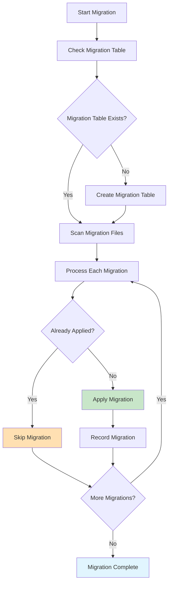
```mermaid
graph TD
    START[Start Migration] --> CHECK[Check Migration Table]
    CHECK --> EXISTS{Migration Table Exists?}
    
    EXISTS -->|No| CREATE[Create Migration Table]
    EXISTS -->|Yes| SCAN[Scan Migration Files]
    CREATE --> SCAN
    
    SCAN --> PROCESS[Process Each Migration]
    PROCESS --> APPLIED{Already Applied?}
    
    APPLIED -->|No| APPLY[Apply Migration]
    APPLIED -->|Yes| SKIP[Skip Migration]
    
    APPLY --> RECORD[Record Migration]
    SKIP --> NEXT{More Migrations?}
    RECORD --> NEXT
    
    NEXT -->|Yes| PROCESS
    NEXT -->|No| COMPLETE[Migration Complete]
    
    style APPLY fill:#C8E6C9
    style SKIP fill:#FFE0B2
    style COMPLETE fill:#E1F5FE
```

---

## 🔄 API Flow Diagrams

### User Registration Flow

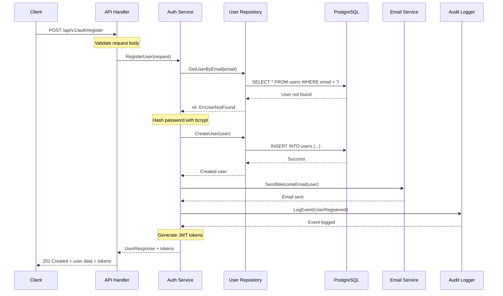
```mermaid
sequenceDiagram
    participant C as Client
    participant API as API Handler
    participant Auth as Auth Service
    participant Repo as User Repository
    participant DB as PostgreSQL
    participant Email as Email Service
    participant Audit as Audit Logger
    
    C->>API: POST /api/v1/auth/register
    Note over API: Validate request body
    
    API->>Auth: RegisterUser(request)
    Auth->>Repo: GetUserByEmail(email)
    Repo->>DB: SELECT * FROM users WHERE email = ?
    DB-->>Repo: User not found
    Repo-->>Auth: nil, ErrUserNotFound
    
    Note over Auth: Hash password with bcrypt
    Auth->>Repo: CreateUser(user)
    Repo->>DB: INSERT INTO users (...)
    DB-->>Repo: Success
    Repo-->>Auth: Created user
    
    Auth->>Email: SendWelcomeEmail(user)
    Email-->>Auth: Email sent
    
    Auth->>Audit: LogEvent(UserRegistered)
    Audit-->>Auth: Event logged
    
    Note over Auth: Generate JWT tokens
    Auth-->>API: UserResponse + tokens
    API-->>C: 201 Created + user data + tokens
```

### Login Authentication Flow

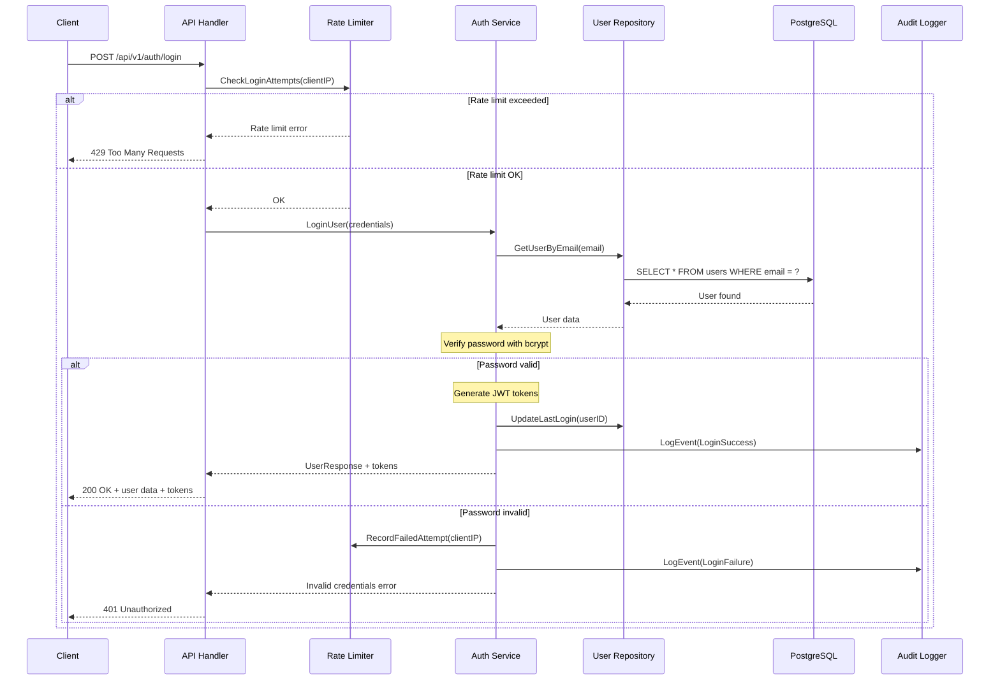
```mermaid
sequenceDiagram
    participant C as Client
    participant API as API Handler
    participant Rate as Rate Limiter
    participant Auth as Auth Service
    participant Repo as User Repository
    participant DB as PostgreSQL
    participant Audit as Audit Logger
    
    C->>API: POST /api/v1/auth/login
    API->>Rate: CheckLoginAttempts(clientIP)
    
    alt Rate limit exceeded
        Rate-->>API: Rate limit error
        API-->>C: 429 Too Many Requests
    else Rate limit OK
        Rate-->>API: OK
        
        API->>Auth: LoginUser(credentials)
        Auth->>Repo: GetUserByEmail(email)
        Repo->>DB: SELECT * FROM users WHERE email = ?
        DB-->>Repo: User found
        Repo-->>Auth: User data
        
        Note over Auth: Verify password with bcrypt
        
        alt Password valid
            Note over Auth: Generate JWT tokens
            Auth->>Repo: UpdateLastLogin(userID)
            Auth->>Audit: LogEvent(LoginSuccess)
            Auth-->>API: UserResponse + tokens
            API-->>C: 200 OK + user data + tokens
        else Password invalid
            Auth->>Rate: RecordFailedAttempt(clientIP)
            Auth->>Audit: LogEvent(LoginFailure)
            Auth-->>API: Invalid credentials error
            API-->>C: 401 Unauthorized
        end
    end
```

### JWT Token Validation Flow

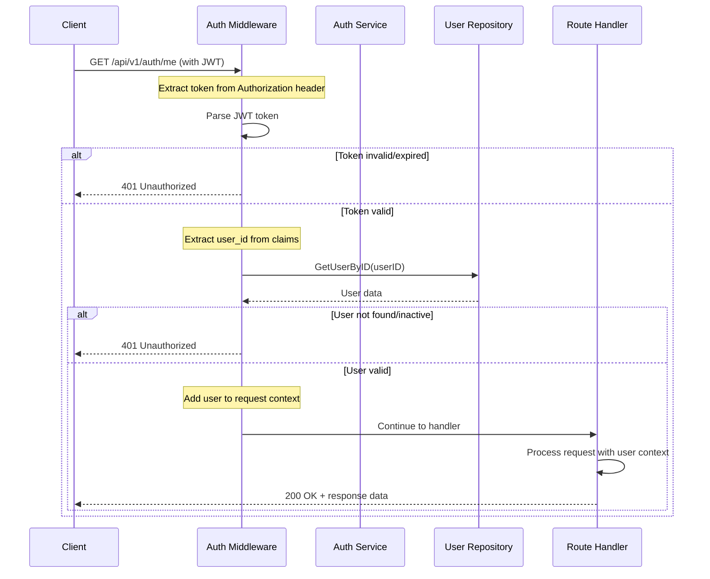
```mermaid
sequenceDiagram
    participant C as Client
    participant MW as Auth Middleware
    participant Auth as Auth Service
    participant Repo as User Repository
    participant Handler as Route Handler
    
    C->>MW: GET /api/v1/auth/me (with JWT)
    Note over MW: Extract token from Authorization header
    
    MW->>MW: Parse JWT token
    
    alt Token invalid/expired
        MW-->>C: 401 Unauthorized
    else Token valid
        Note over MW: Extract user_id from claims
        MW->>Repo: GetUserByID(userID)
        Repo-->>MW: User data
        
        alt User not found/inactive
            MW-->>C: 401 Unauthorized
        else User valid
            Note over MW: Add user to request context
            MW->>Handler: Continue to handler
            Handler->>Handler: Process request with user context
            Handler-->>C: 200 OK + response data
        end
    end
```

### Password Reset Flow

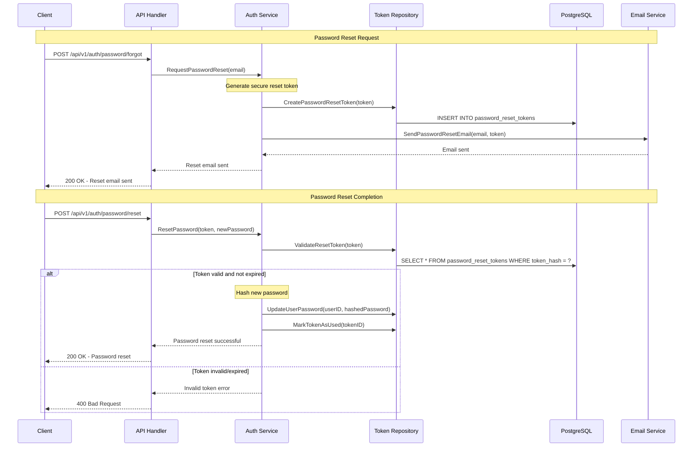
```mermaid
sequenceDiagram
    participant C as Client
    participant API as API Handler
    participant Auth as Auth Service
    participant Repo as Token Repository
    participant DB as PostgreSQL
    participant Email as Email Service
    
    Note over C, Email: Password Reset Request
    C->>API: POST /api/v1/auth/password/forgot
    API->>Auth: RequestPasswordReset(email)
    
    Note over Auth: Generate secure reset token
    Auth->>Repo: CreatePasswordResetToken(token)
    Repo->>DB: INSERT INTO password_reset_tokens
    
    Auth->>Email: SendPasswordResetEmail(email, token)
    Email-->>Auth: Email sent
    Auth-->>API: Reset email sent
    API-->>C: 200 OK - Reset email sent
    
    Note over C, Email: Password Reset Completion
    C->>API: POST /api/v1/auth/password/reset
    API->>Auth: ResetPassword(token, newPassword)
    
    Auth->>Repo: ValidateResetToken(token)
    Repo->>DB: SELECT * FROM password_reset_tokens WHERE token_hash = ?
    
    alt Token valid and not expired
        Note over Auth: Hash new password
        Auth->>Repo: UpdateUserPassword(userID, hashedPassword)
        Auth->>Repo: MarkTokenAsUsed(tokenID)
        Auth-->>API: Password reset successful
        API-->>C: 200 OK - Password reset
    else Token invalid/expired
        Auth-->>API: Invalid token error
        API-->>C: 400 Bad Request
    end
```

---

## 🔒 Security Architecture

### Authentication & Authorization Flow

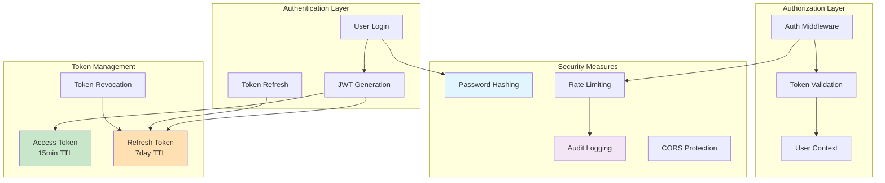
```mermaid
graph TD
    subgraph "Authentication Layer"
        LOGIN[User Login]
        JWT_GEN[JWT Generation]
        REFRESH[Token Refresh]
    end
    
    subgraph "Authorization Layer"
        MW_AUTH[Auth Middleware]
        TOKEN_VAL[Token Validation]
        USER_CTX[User Context]
    end
    
    subgraph "Security Measures"
        HASH[Password Hashing]
        RATE[Rate Limiting]
        AUDIT[Audit Logging]
        CORS[CORS Protection]
    end
    
    subgraph "Token Management"
        ACCESS[Access Token<br/>15min TTL]
        REFRESH_T[Refresh Token<br/>7day TTL]
        REVOKE[Token Revocation]
    end
    
    LOGIN --> HASH
    LOGIN --> JWT_GEN
    JWT_GEN --> ACCESS
    JWT_GEN --> REFRESH_T
    
    MW_AUTH --> TOKEN_VAL
    TOKEN_VAL --> USER_CTX
    
    RATE --> AUDIT
    MW_AUTH --> RATE
    
    REFRESH --> REFRESH_T
    REVOKE --> REFRESH_T
    
    style ACCESS fill:#C8E6C9
    style REFRESH_T fill:#FFE0B2
    style HASH fill:#E1F5FE
    style AUDIT fill:#F3E5F5
```

### Security Headers & Protection

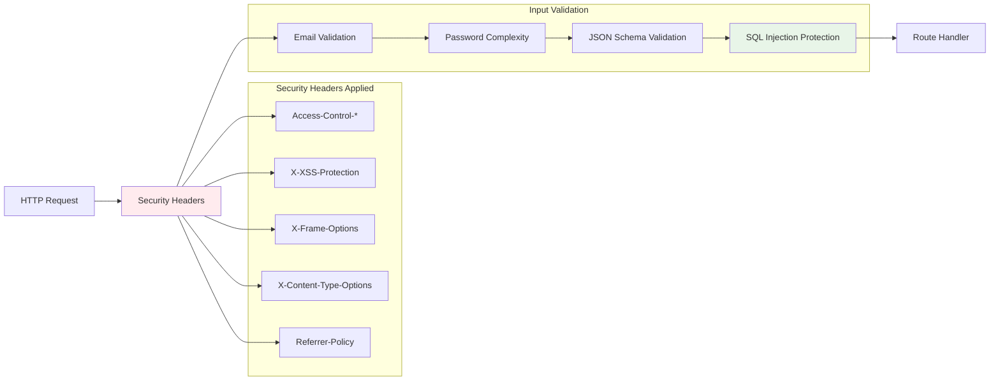
```mermaid
graph LR
    REQ[HTTP Request] --> SEC_HEADERS[Security Headers]
    
    subgraph "Security Headers Applied"
        CORS_H[Access-Control-*]
        XSS[X-XSS-Protection]
        FRAME[X-Frame-Options]
        CONTENT[X-Content-Type-Options]
        REFERRER[Referrer-Policy]
    end
    
    SEC_HEADERS --> CORS_H
    SEC_HEADERS --> XSS
    SEC_HEADERS --> FRAME
    SEC_HEADERS --> CONTENT
    SEC_HEADERS --> REFERRER
    
    subgraph "Input Validation"
        EMAIL_VAL[Email Validation]
        PASS_VAL[Password Complexity]
        JSON_VAL[JSON Schema Validation]
        SQL_PROTECT[SQL Injection Protection]
    end
    
    SEC_HEADERS --> EMAIL_VAL
    EMAIL_VAL --> PASS_VAL
    PASS_VAL --> JSON_VAL
    JSON_VAL --> SQL_PROTECT
    
    SQL_PROTECT --> HANDLER[Route Handler]
    
    style SEC_HEADERS fill:#FFEBEE
    style SQL_PROTECT fill:#E8F5E8
```

---

## 🚀 Deployment Architecture

### Docker Container Architecture

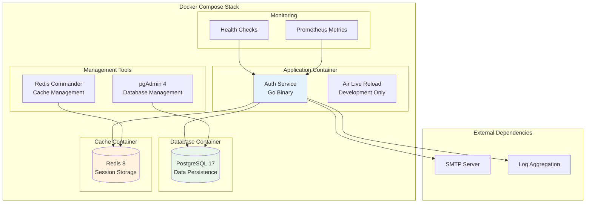
```mermaid
graph TB
    subgraph "Docker Compose Stack"
        subgraph "Application Container"
            APP[Auth Service<br/>Go Binary]
            AIR[Air Live Reload<br/>Development Only]
        end
        
        subgraph "Database Container"
            PG[(PostgreSQL 17<br/>Data Persistence)]
        end
        
        subgraph "Cache Container"
            REDIS[(Redis 8<br/>Session Storage)]
        end
        
        subgraph "Management Tools"
            PGADMIN[pgAdmin 4<br/>Database Management]
            REDIS_CMD[Redis Commander<br/>Cache Management]
        end
        
        subgraph "Monitoring"
            HEALTH[Health Checks]
            METRICS[Prometheus Metrics]
        end
    end
    
    subgraph "External Dependencies"
        SMTP[SMTP Server]
        LOGS[Log Aggregation]
    end
    
    APP --> PG
    APP --> REDIS
    APP --> SMTP
    APP --> LOGS
    
    PGADMIN --> PG
    REDIS_CMD --> REDIS
    
    HEALTH --> APP
    METRICS --> APP
    
    style APP fill:#E3F2FD
    style PG fill:#E8F5E8
    style REDIS fill:#FFF3E0
```

### Kubernetes Deployment Architecture

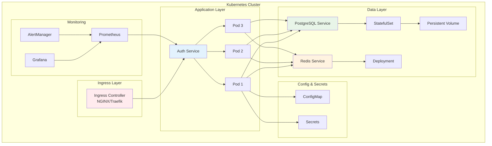
```mermaid
graph TB
    subgraph "Kubernetes Cluster"
        subgraph "Ingress Layer"
            INGRESS[Ingress Controller<br/>NGINX/Traefik]
        end
        
        subgraph "Application Layer"
            AUTH_SVC[Auth Service]
            AUTH_POD1[Pod 1]
            AUTH_POD2[Pod 2]
            AUTH_POD3[Pod 3]
        end
        
        subgraph "Data Layer"
            PG_SVC[PostgreSQL Service]
            PG_STATEFUL[StatefulSet]
            PG_PVC[Persistent Volume]
            
            REDIS_SVC[Redis Service]
            REDIS_DEPLOY[Deployment]
        end
        
        subgraph "Config & Secrets"
            CONFIG_MAP[ConfigMap]
            SECRETS[Secrets]
        end
        
        subgraph "Monitoring"
            PROMETHEUS[Prometheus]
            GRAFANA[Grafana]
            ALERT[AlertManager]
        end
    end
    
    INGRESS --> AUTH_SVC
    AUTH_SVC --> AUTH_POD1
    AUTH_SVC --> AUTH_POD2
    AUTH_SVC --> AUTH_POD3
    
    AUTH_POD1 --> PG_SVC
    AUTH_POD2 --> PG_SVC
    AUTH_POD3 --> PG_SVC
    
    AUTH_POD1 --> REDIS_SVC
    AUTH_POD2 --> REDIS_SVC
    AUTH_POD3 --> REDIS_SVC
    
    PG_SVC --> PG_STATEFUL
    PG_STATEFUL --> PG_PVC
    
    REDIS_SVC --> REDIS_DEPLOY
    
    AUTH_POD1 --> CONFIG_MAP
    AUTH_POD1 --> SECRETS
    
    PROMETHEUS --> AUTH_SVC
    GRAFANA --> PROMETHEUS
    ALERT --> PROMETHEUS
    
    style INGRESS fill:#FFEBEE
    style AUTH_SVC fill:#E3F2FD
    style PG_SVC fill:#E8F5E8
    style REDIS_SVC fill:#FFF3E0
```

---

## 📊 Data Flow Patterns

### Request Processing Pipeline

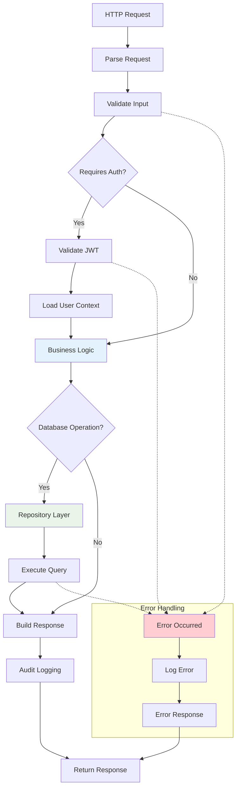
```mermaid
graph TD
    START[HTTP Request] --> PARSE[Parse Request]
    PARSE --> VALIDATE[Validate Input]
    VALIDATE --> AUTH_CHECK{Requires Auth?}
    
    AUTH_CHECK -->|Yes| JWT_VAL[Validate JWT]
    AUTH_CHECK -->|No| BUSINESS[Business Logic]
    
    JWT_VAL --> USER_LOAD[Load User Context]
    USER_LOAD --> BUSINESS
    
    BUSINESS --> DB_OP{Database Operation?}
    
    DB_OP -->|Yes| REPO[Repository Layer]
    DB_OP -->|No| RESPONSE[Build Response]
    
    REPO --> DB_EXEC[Execute Query]
    DB_EXEC --> RESPONSE
    
    RESPONSE --> AUDIT[Audit Logging]
    AUDIT --> RETURN[Return Response]
    
    subgraph "Error Handling"
        ERROR[Error Occurred]
        LOG_ERR[Log Error]
        ERR_RESP[Error Response]
    end
    
    VALIDATE -.-> ERROR
    JWT_VAL -.-> ERROR
    DB_EXEC -.-> ERROR
    
    ERROR --> LOG_ERR
    LOG_ERR --> ERR_RESP
    ERR_RESP --> RETURN
    
    style BUSINESS fill:#E3F2FD
    style REPO fill:#E8F5E8
    style ERROR fill:#FFCDD2
```

### Token Lifecycle Management

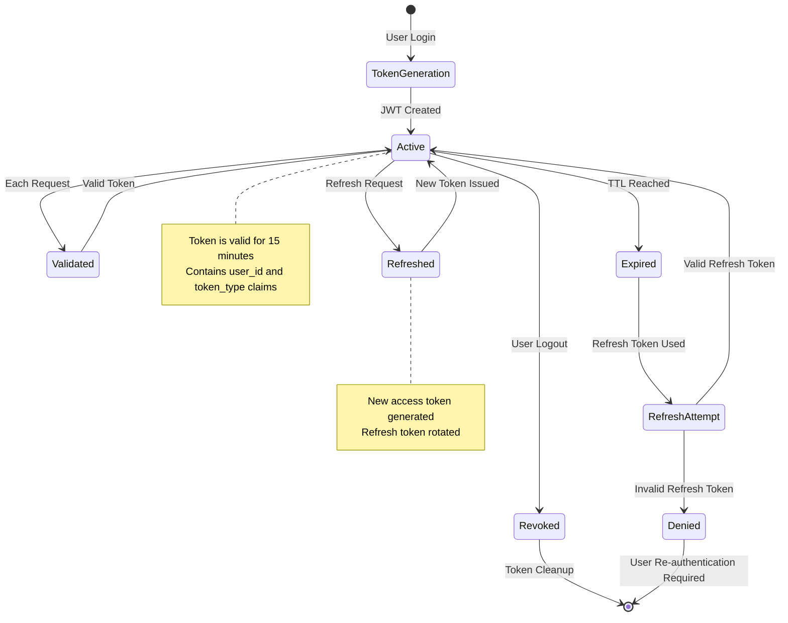
```mermaid
stateDiagram-v2
    [*] --> TokenGeneration: User Login
    
    TokenGeneration --> Active: JWT Created
    Active --> Validated: Each Request
    Validated --> Active: Valid Token
    
    Active --> Expired: TTL Reached
    Active --> Revoked: User Logout
    Active --> Refreshed: Refresh Request
    
    Refreshed --> Active: New Token Issued
    
    Expired --> RefreshAttempt: Refresh Token Used
    RefreshAttempt --> Active: Valid Refresh Token
    RefreshAttempt --> Denied: Invalid Refresh Token
    
    Revoked --> [*]: Token Cleanup
    Denied --> [*]: User Re-authentication Required
    
    note right of Active
        Token is valid for 15 minutes
        Contains user_id and token_type claims
    end note
    
    note right of Refreshed
        New access token generated
        Refresh token rotated
    end note
```

### Error Handling Flow

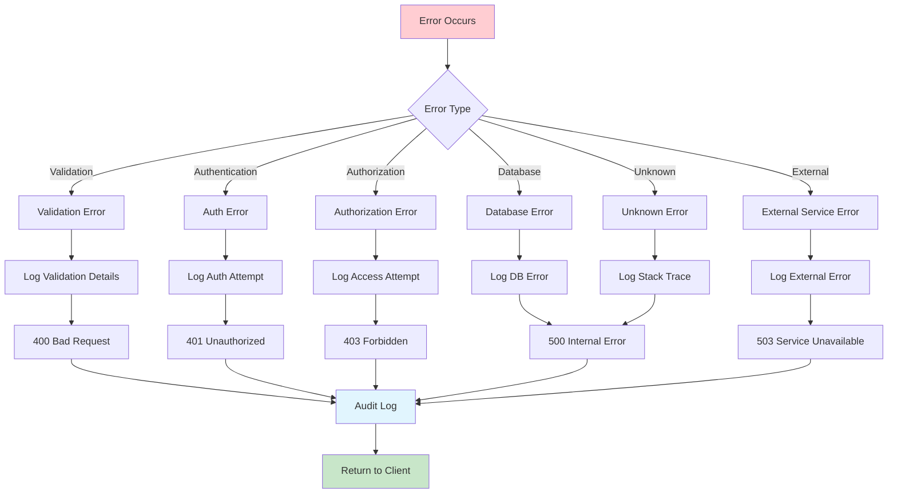
```mermaid
graph TD
    ERROR[Error Occurs] --> TYPE{Error Type}
    
    TYPE -->|Validation| VALIDATION[Validation Error]
    TYPE -->|Authentication| AUTH_ERR[Auth Error]
    TYPE -->|Authorization| AUTHZ_ERR[Authorization Error]
    TYPE -->|Database| DB_ERR[Database Error]
    TYPE -->|External| EXT_ERR[External Service Error]
    TYPE -->|Unknown| UNKNOWN[Unknown Error]
    
    VALIDATION --> LOG_VAL[Log Validation Details]
    AUTH_ERR --> LOG_AUTH[Log Auth Attempt]
    AUTHZ_ERR --> LOG_AUTHZ[Log Access Attempt]
    DB_ERR --> LOG_DB[Log DB Error]
    EXT_ERR --> LOG_EXT[Log External Error]
    UNKNOWN --> LOG_UNKNOWN[Log Stack Trace]
    
    LOG_VAL --> RESP_400[400 Bad Request]
    LOG_AUTH --> RESP_401[401 Unauthorized]
    LOG_AUTHZ --> RESP_403[403 Forbidden]
    LOG_DB --> RESP_500[500 Internal Error]
    LOG_EXT --> RESP_503[503 Service Unavailable]
    LOG_UNKNOWN --> RESP_500
    
    RESP_400 --> AUDIT_LOG[Audit Log]
    RESP_401 --> AUDIT_LOG
    RESP_403 --> AUDIT_LOG
    RESP_500 --> AUDIT_LOG
    RESP_503 --> AUDIT_LOG
    
    AUDIT_LOG --> CLIENT[Return to Client]
    
    style ERROR fill:#FFCDD2
    style AUDIT_LOG fill:#E1F5FE
    style CLIENT fill:#C8E6C9
```

---

## 🔍 Monitoring & Observability

### Metrics and Monitoring Architecture

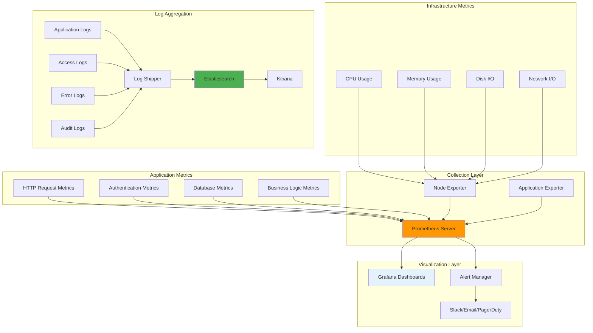
```mermaid
graph TB
    subgraph "Application Metrics"
        HTTP_METRICS[HTTP Request Metrics]
        AUTH_METRICS[Authentication Metrics]
        DB_METRICS[Database Metrics]
        BUSINESS_METRICS[Business Logic Metrics]
    end
    
    subgraph "Infrastructure Metrics"
        CPU[CPU Usage]
        MEMORY[Memory Usage]
        DISK[Disk I/O]
        NETWORK[Network I/O]
    end
    
    subgraph "Collection Layer"
        PROMETHEUS[Prometheus Server]
        NODE_EXPORTER[Node Exporter]
        APP_EXPORTER[Application Exporter]
    end
    
    subgraph "Visualization Layer"
        GRAFANA[Grafana Dashboards]
        ALERTS[Alert Manager]
        NOTIFICATIONS[Slack/Email/PagerDuty]
    end
    
    subgraph "Log Aggregation"
        APP_LOGS[Application Logs]
        ACCESS_LOGS[Access Logs]
        ERROR_LOGS[Error Logs]
        AUDIT_LOGS[Audit Logs]
        
        LOG_SHIPPER[Log Shipper]
        ELASTIC[Elasticsearch]
        KIBANA[Kibana]
    end
    
    HTTP_METRICS --> PROMETHEUS
    AUTH_METRICS --> PROMETHEUS
    DB_METRICS --> PROMETHEUS
    BUSINESS_METRICS --> PROMETHEUS
    
    CPU --> NODE_EXPORTER
    MEMORY --> NODE_EXPORTER
    DISK --> NODE_EXPORTER
    NETWORK --> NODE_EXPORTER
    
    NODE_EXPORTER --> PROMETHEUS
    APP_EXPORTER --> PROMETHEUS
    
    PROMETHEUS --> GRAFANA
    PROMETHEUS --> ALERTS
    ALERTS --> NOTIFICATIONS
    
    APP_LOGS --> LOG_SHIPPER
    ACCESS_LOGS --> LOG_SHIPPER
    ERROR_LOGS --> LOG_SHIPPER
    AUDIT_LOGS --> LOG_SHIPPER
    
    LOG_SHIPPER --> ELASTIC
    ELASTIC --> KIBANA
    
    style PROMETHEUS fill:#FF9800
    style GRAFANA fill:#E3F2FD
    style ELASTIC fill:#4CAF50
```

---

## 📝 Architecture Decision Records (ADRs)

### Key Architectural Decisions

| Decision | Rationale | Trade-offs |
|----------|-----------|------------|
| **Clean Architecture** | Maintainable, testable, framework-independent | Initial complexity, more boilerplate |
| **JWT Tokens** | Stateless, scalable, standard | Token size, rotation complexity |
| **PostgreSQL** | ACID compliance, rich feature set, performance | Complexity vs NoSQL simplicity |
| **Redis for Caching** | High performance, pub/sub capabilities | Additional infrastructure |
| **Gin Framework** | Performance, simplicity, middleware ecosystem | Less opinionated than full frameworks |
| **bcrypt for Passwords** | Industry standard, adaptive hashing | Computational cost |
| **Repository Pattern** | Testability, data source abstraction | Additional abstraction layer |

---

## 🎯 Summary

This architecture provides:

- **🏗️ Scalable Foundation**: Clean Architecture ensures maintainability and testability
- **🔒 Security First**: JWT tokens, password hashing, rate limiting, and audit logging
- **📈 Performance**: Redis caching, connection pooling, optimized queries
- **🔍 Observability**: Comprehensive logging, metrics, and health checks
- **🚀 Deployment Ready**: Docker containers and Kubernetes manifests
- **🧪 Test Ready**: Dependency injection and mocked interfaces
- **📚 Documentation**: Complete API documentation and architecture diagrams

The microservice follows industry best practices and is designed for production deployment with high availability, security, and performance requirements.

---

## 📚 Additional Resources

- [Clean Architecture by Robert C. Martin](https://blog.cleancoder.com/uncle-bob/2012/08/13/the-clean-architecture.html)
- [JWT Best Practices](https://auth0.com/blog/a-look-at-the-latest-draft-for-jwt-bcp/)
- [Go Project Layout](https://github.com/golang-standards/project-layout)
- [Database Migration Patterns](https://martinfowler.com/articles/evodb.html)
- [Microservices Security Patterns](https://microservices.io/patterns/security/)
